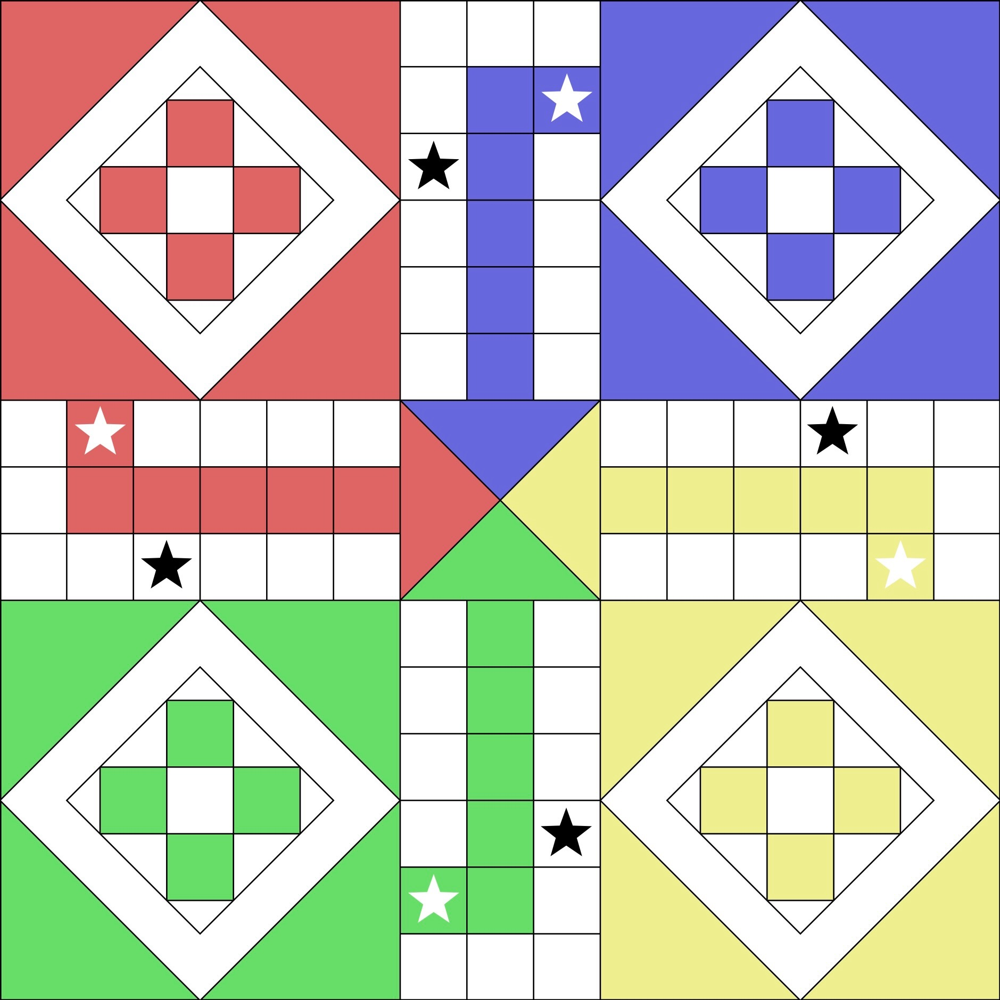

# Ludo

A traditional Indian board game

## Board Layout



## Start

```sh
TODO
```

## Q&A

**It is not working**

I am working on it since i forked it

**This is not Ludo. It should be such and such, when player does so and so**

I'm sorry to hear! I could not find enough resource to understand the rule.
Perhaps, it is one of many variants.

**You do not follow the rule in the reference you provide**

A rule found in each reference is slightly different from another.
The final compiled rule of "my" Ludo can be understood better with 
[glossary](docs/glossary.md) and [rules](docs/rules.md)

## References

[Game rules Ludo](https://www.gamevelvet.com/ludo-online/rules)

[Learn How To Play Ludo Game](https://youtu.be/lns9TeKVebY)
