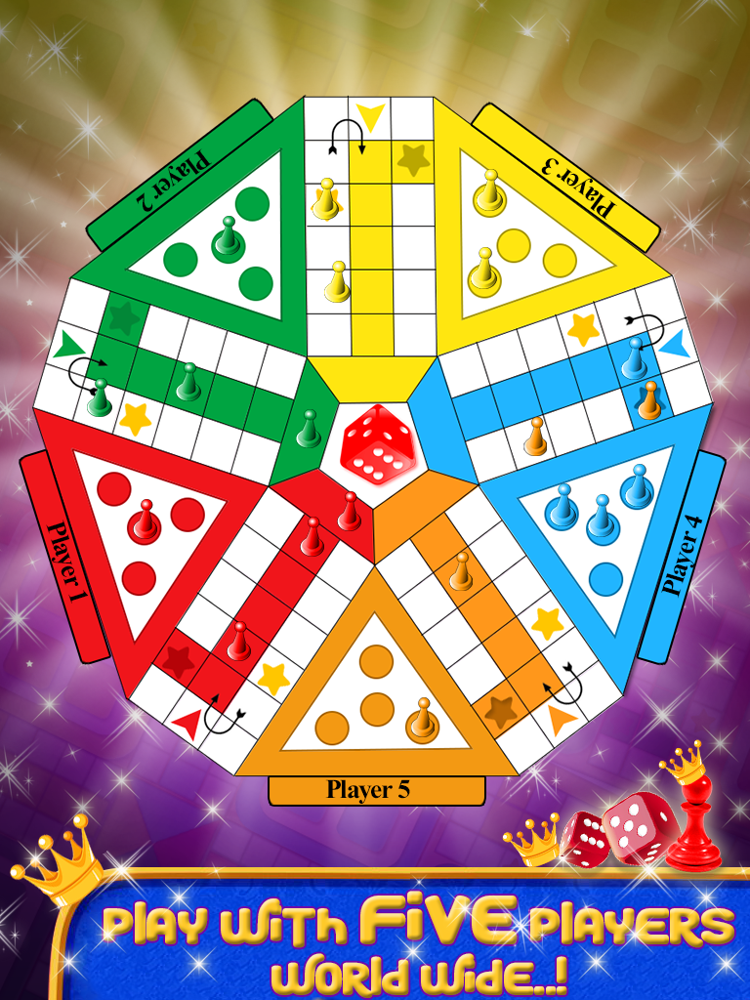
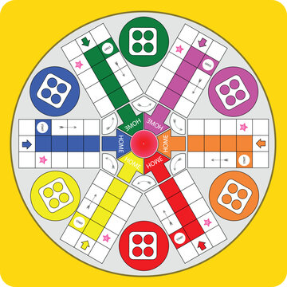
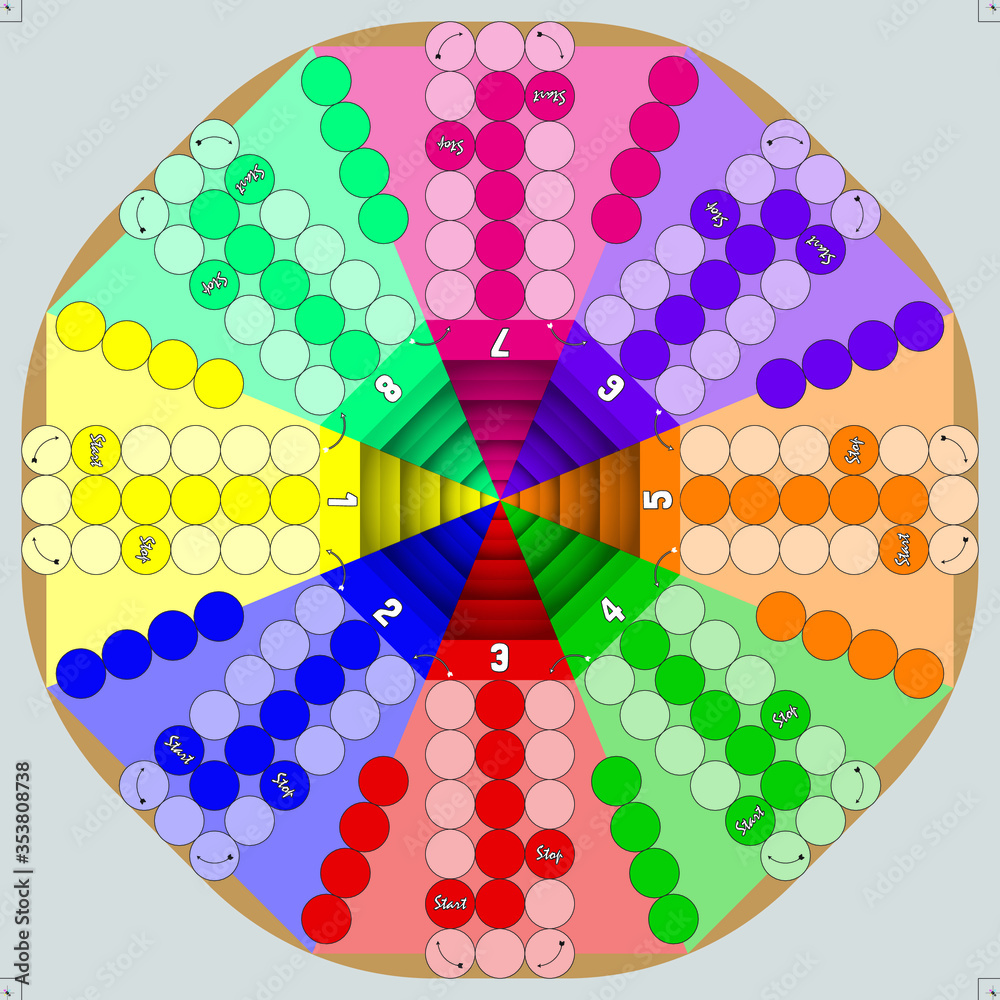
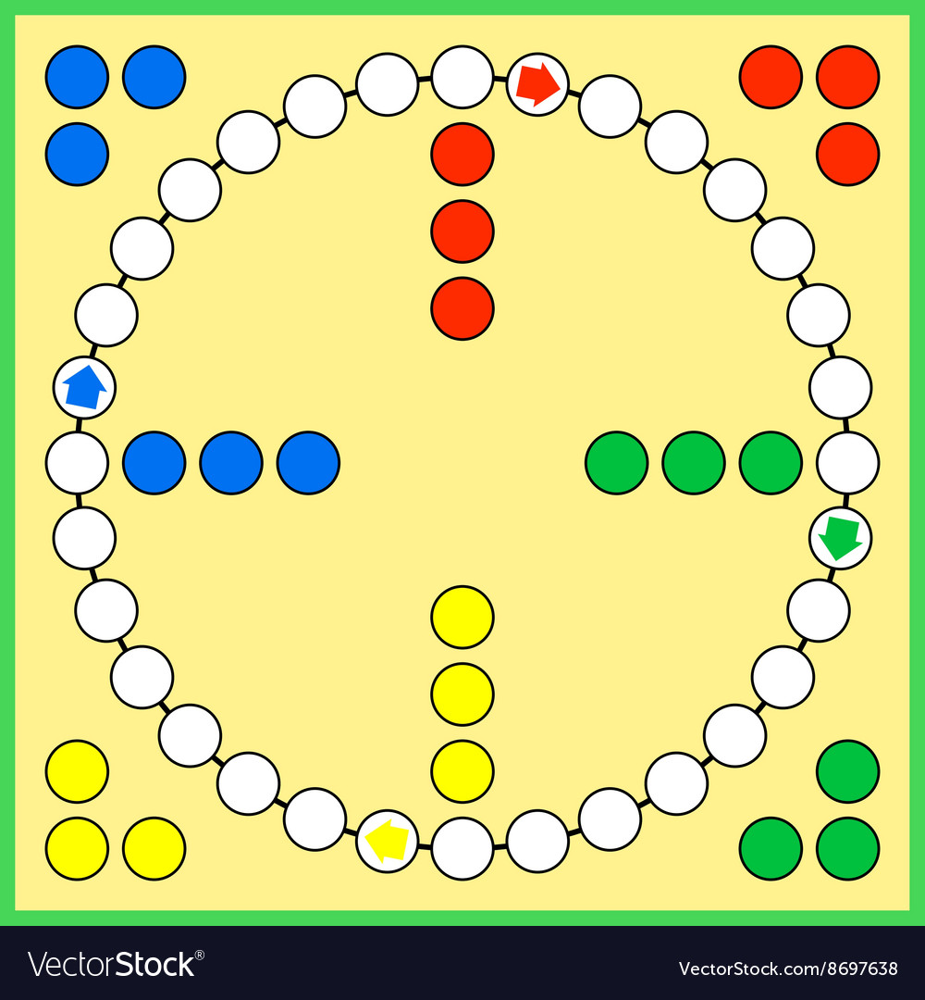
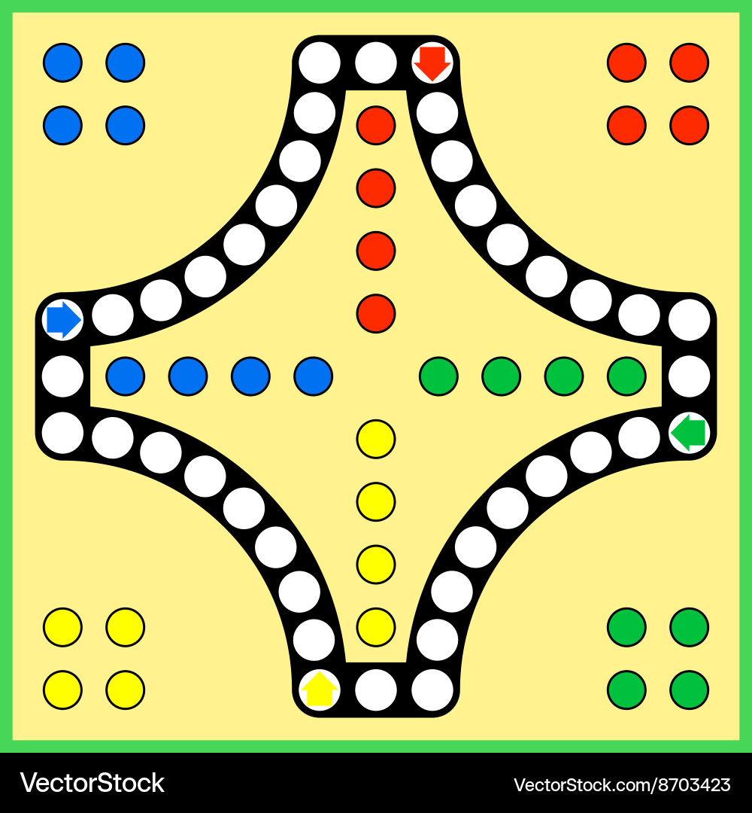
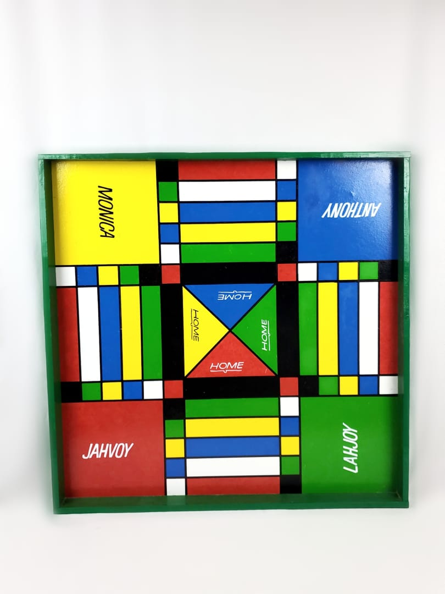
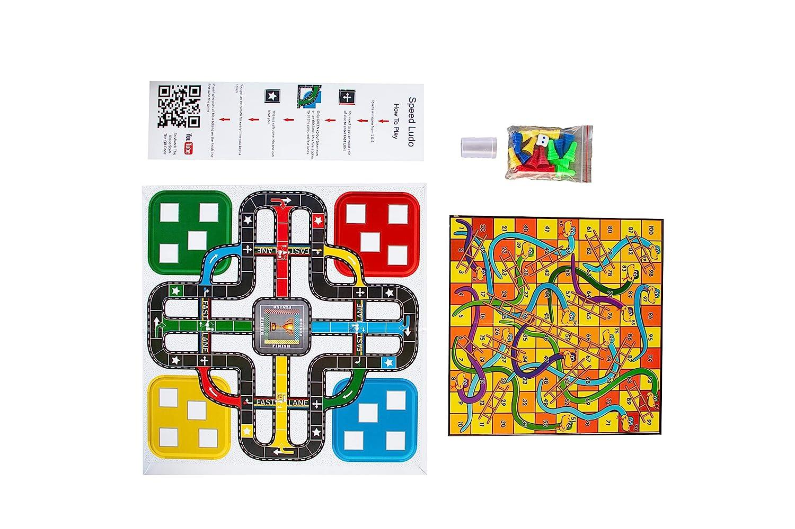
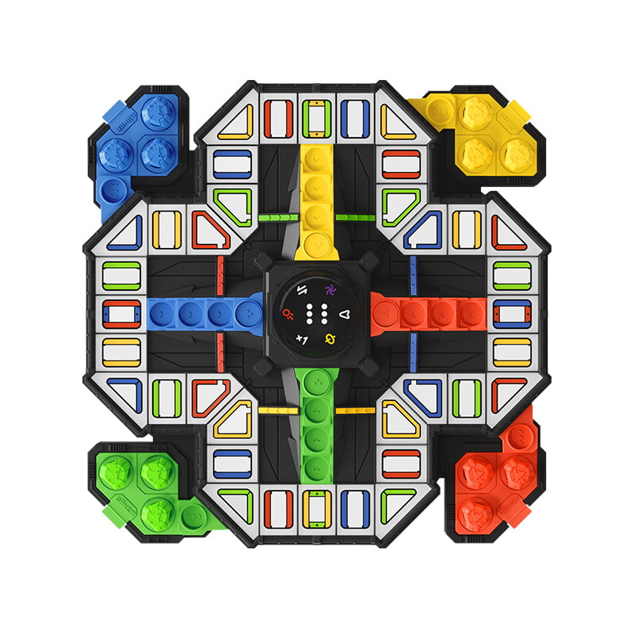
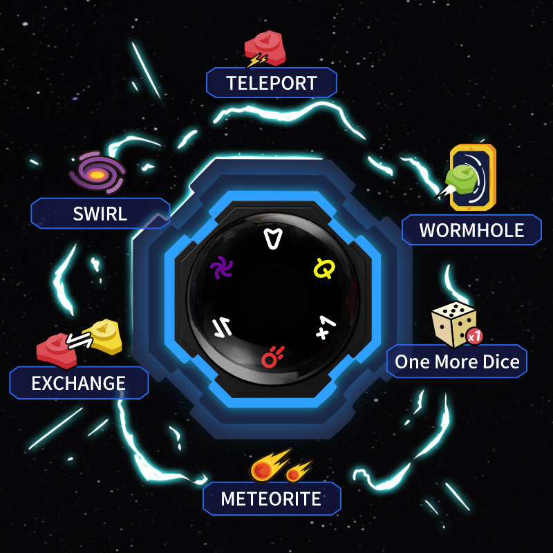

# Topology of Ludo

## Table of Contents

- [Examples](#examples)
    - [Basic](#basic)
    - [Variant: Five Players](#variant-five-players)
    - [Variant: Six Players](#variant-six-players)
    - [Variant: Eight Players](#variant-eight-players)
    - [Variant: Three Players](#variant-three-players)
    - [Variant: Circular](#variant-circular)
    - [Variant: Diamond](#variant-diamond)
    - [Variant: Jamaican](#variant-jamaican)
    - [Variant: Fastlane](#variant-fastlane)
    - [Variant: Giiker](#variant-giiker)

- [May not cover?](#may-not-cover)
    - [Special Effects](#special-effects)

## Examples

### Basic


```yaml
max-number-of-players: 4
pawns-per-player: 4
length-finishline: 5
# may regard safezon-0 as entry
safezone-1:
# smaller distance 5 < 8
- distance-to-entry: 5   
entry-to-entry: 13
```
### Variant: Five Players



```yaml
max-number-of-players: 5
pawns-per-player: 4
length-finishline: 5
# may regard safezone-0 as entry
safezone-1:
# smaller distance: 5 < 8
- distance-to-entry: 5
entry-to-entry: 13
```

### Variant: Six Players



```yaml
max-number-of-players: 6
pawns-per-player: 4
length-finishline: 4
# may regard safezon-0 as entry
safezone-1:
# smaller distance 4 < 7
- distance-to-entry: 4
entry-to-entry: 11
```

**NOTE**: corners are usually skipped. if not skipped:
```yaml
entry-to-entry: 12
```

### Variant: Eight Players



```yaml
max-number-of-players: 8
pawns-per-player: 4
length-finishline: 5
# may regard safezon-0 as entry
safezone-1:
# smaller distance: 5 < 8
- distance-to-entry: 5
entry-to-entry: 13
```

### Variant: Three Players


```yaml
max-number-of-players: 3
pawns-per-player: 4
length-finishline: 5
# may regard safezone-0 as entry
safezone-1:
# smaller distance: 5 < 8
- distance-to-entry: 5
entry-to-entry: 13
```

### Variant: Circular



```yaml
max-number-of-players: 4
pawns-per-player: 3
length-finishline: 3
# No safezone-1 given(the four entries are the only safezone)
entry-to-entry: 8
```

### Variant: Diamond

It may look like meta, but it isn't



```yaml
max-number-of-players: 4
pawns-per-player: 4
length-finishline: 5
# No safezone-1 given(the four entries are the only safezone)
entry-to-entry: 10
```

### Variant: Jamaican



```yaml
max-number-of-players: 4
pawns-per-player: 4
length-finishline: 5
# No safezone-1 given(the four entries are the only safezone)
entry-to-entry: 12
```

**NOTE**
- `paws-per-player` is 4 by [How to Play Jamaican Ludo](https://youtu.be/_GVtXl6JPYU)
- Corners are [not skipped](images/jamaican-1.png)

### Variant: Fastlane



```yaml
max-number-of-players: 4
pawns-per-player: 4
length-finishline: 5
# No safezone-1 given(the four entries are the only safezone)
entry-to-entry: 13
```
**NOTE**: it has FAST LANEs

**NOTE**: it looks like you don't skip the corner between sidewalks?

### Variant: Giiker



```yaml
max-number-of-players: 4
pawns-per-player: 3
length-finishline: 4
# No safezone-1 given(the four entries are the only safezone)
entry-to-entry: 9
```

**NOTE**: Are those thin lines, something like FAST LANEs?

## Thinking of possible variant

### Discriminatory variant

- Violates equal value among players: sidewalk, pawns, ...

## May not cover?

### Special effects

Speicial effects from Variant 9
